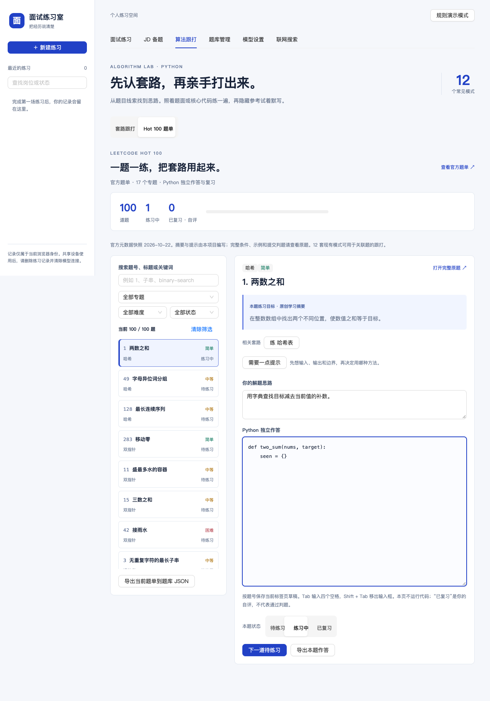

# 面试练习室

一个本地运行的全流程求职面试助手：整理简历 → 发现岗位并审批沟通 → 会话带入备题 → 模拟面试 → 复盘与算法训练，资料默认保存在本机。

AI 是可选能力：简历、JD 或作答只会发送到你显式选择并确认的模型；启用联网搜索时只发送你确认的关键词（2 至 200 字），不发送简历、JD 或作答。不配置模型也可以使用规则演示、备题、题库与算法练习。业务数据与 Agent 数据分别保存在本机 SQLite 文件中。工具记录过程与依据，不承诺面试结果或录用。

[快速开始](#快速开始) · [九大模块](#覆盖求职全流程的-9-大模块) · [使用指南](docs/user-guide.md) · [JSON 简历制作](docs/resume-builder.md) · [开发与验证](#开发与验证)

## 覆盖求职全流程的 9 大模块

按求职自然顺序排列。“开发中”表示设计已登记、真实站点与外部服务尚未验收；“计划”表示只有设计，不是已接通能力。

| # | 模块 | 你能做什么 | 与其他模块的联动 |
| --- | --- | --- | --- |
| 1 | 简历整理 | 导入 PDF、DOCX、TXT、Markdown；简历库保存不可变版本；JSON 简历制作支持七套主题、实时预览与 JSON、HTML、A4 PDF 导出。 | 已保存副本可带入面试准备，也可另存为投递附件。 |
| 2 | 岗位发现 | BOSS 求职按城市、预设或最多六个自定义方向搜索，保存岗位快照与筛选依据（开发中，真实站点未验收）。 | 搜索预览不要求简历或模型；预览结果经人工复核后才进入沟通。 |
| 3 | 审批与沟通 | 人工复核岗位后由 Worker 串行发起站内沟通，逐岗记录已发起、等待同意、失败和结果未知（开发中）。 | 点过按钮或任务完成不等于消息送达，也不等于附件已发送。 |
| 4 | 会话跟进 | 手动同步专用窗口当前已交换简历的会话，保存公司、JD 与可见消息（开发中，已验证单会话同步）。 | 已同步会话可选择简历带入 JD 备题与模拟面试。 |
| 5 | JD 备题 | 基于 JD 生成 3 至 12 道带原文依据的题单，区分岗位必备项与加分项，编辑后入库或带入练习，支持复制 Markdown 分享、下载 Markdown / A4 PDF 题单，并保留备题历史与重试。 | 勾选的题以严格模式原题进入模拟面试，题面不会被改写。 |
| 6 | 模拟面试 | 按简历、JD、候选人级别、轮次与时长规划文本面试，逐题作答与反馈，可导出 Markdown 或 JSON 报告。 | 报告可把具体 QA 加入复习清单；已开始的面试固定使用当时的模型快照。 |
| 7 | 复盘与复习 | 面试历史支持搜索与轻量分页，逐题复查回答、依据与改进方向，复习清单按到期时间排序提醒。 | 复习清单可回看原作答依据、写笔记并标记已复习；删除面试会一并清理关联复习。 |
| 8 | 算法训练 | 内置 LeetCode Hot 100 题单快照、Python 编辑器、套路跟打、笔记与复习进度；题库支持自建与导入。 | 编程题与题库题可带入练习；Hot 100 可显式在浏览器隔离环境运行固定用例，不代表官方判题通过，首次需联网下载 Python 运行时。 |
| 9 | 模型与本机数据 | 自带模型连接、模型列表与连接测试，可选 Tavily / Firecrawl 联网搜索，本机草稿、备份与恢复。 | 模式标识说明当前用的是演示还是 AI；本机数据页可导出备份。 |

Hot 100 验证入口、隔离边界及测试命令见 [固定用例验证](docs/hot100-validation.md)。

### 界面预览



## 快速开始

### 环境要求

- Node.js **22.16+**。
- pnpm **12.11.2**，与 `package.json` 中的 `packageManager` 保持一致。
- 使用 BOSS 专用窗口或运行浏览器测试时，需要安装 Google Chrome。
- 运行 Python 算法模板测试时，需要 Python 3。

项目仅使用 SQLite，无需数据库服务器。项目自带的 Bun 运行时用于 Agent 服务；Redis 通知为可选配置。

### 安装与启动

在仓库根目录执行：

```sh
pnpm install --frozen-lockfile --ignore-scripts
pnpm runtime:setup
node node_modules/esbuild/install.js
```

首次使用时创建配置文件。已有 `.env` 请保留，不要覆盖。

```sh
cp .env.example .env
pnpm db:migrate
pnpm dev
```

打开 **[http://localhost:5173](http://localhost:5173)**。

| 服务 | 默认地址 |
| --- | --- |
| Web | http://localhost:5173 |
| API | http://localhost:3000/api/v1 |
| Agent | http://localhost:4111 |

检查服务状态：

```sh
pnpm run doctor
```

API 健康检查地址为 `http://localhost:3000/api/v1/health`。请使用 `pnpm run doctor`，避免与 pnpm 自带的 `doctor` 命令混淆。

### 第一次使用

0. 也可以从 **求职管理 → 已交换简历会话** 选择一条已同步会话，或在 **求职管理 → BOSS 求职** 搜索目标岗位，审批并同步会话后带入下列准备流程。
1. 进入 **面试准备**，上传或粘贴简历，填写目标岗位与 JD。
2. 选择候选人级别、面试轮次与时长，开始规则演示。
3. 需要真实 AI 生成时，在 **设置 → 模型设置** 配置并启用自己的连接。
4. 完成作答后查看逐题反馈和报告，或进入 **JD 备题**、**算法练习** 单独使用相关功能。

有效资料进入面试安排前，会按当前 JD 和已选题单判断是否提示提前备题；可以先备题，也可直接继续。已选择的同一资料题单不会重复引导，未确认生成不会调用模型。

规则演示不调用真实模型，演示评分不代表专业能力评价。详细操作见 [使用指南](docs/user-guide.md)。

左侧菜单按 **简历管理、求职管理、面试中心、学习训练、系统设置** 分组；手机使用抽屉菜单。简历库统一提供“简历编辑”和“投递附件”两个标签：前者导入和制作 JSON 副本，后者管理用于投递的不可变原文件版本。旧附件库链接自动进入统一入口，已有附件与任务引用保留。操作步骤见 [简历制作指南](docs/resume-builder.md)。已有安装升级后先运行 `pnpm db:migrate`，再启动服务。

## BOSS 求职

搜索预览默认关闭 AI，不要求简历或模型连接。城市可按市名或省份搜索，从 BOSS 官方快照的 337 个大陆城市选项中多选（最多十个，默认广州、深圳）；支持预设方向和最多六个自定义方向；多个方向按“或”搜索，薪资、黑名单和雇佣关系在读取后逐条核对。

```text
人工登录与检查 → 程序搜索 → 保存快照与筛选 → 人工复核和批准 → Worker 执行沟通 → 核对结果
```

- 浏览器由 **Patchright + 本机 Chrome** 驱动，使用独立持久会话，不导入日常浏览器凭据。
- 明确外包、派遣或中介岗位会被排除；雇佣关系未知的岗位需要人工复核。
- “仅立即沟通”使用 BOSS 已配置的自动招呼，不额外输入消息或发送附件。
- 已批准、点击前失败的记录可通过统一入口逐条继续；结果未知的记录不会自动重发。
- 当前继续控制器运行在页面中，关闭页面会停止后续提交，已排队动作仍由 Worker 执行并记录。
- 登录验证、站点限制或页面异常会阻止后续动作。Patchright 不保证避免平台风控，也不会绕过验证码或访问限制。

默认配置 `BOSS_AUTOMATION=paused`，不会打开或检查 BOSS。按实际使用范围显式选择模式后，需要重启 API 和 Worker：

| 模式 | 范围 |
| --- | --- |
| `paused` | 暂停站点自动化。 |
| `manual` | 手动登录、会话检查和主动发起的只读会话同步。 |
| `search` | 允许搜索预览，禁止沟通和附件投递。 |
| `contact` | 允许搜索及已批准的原生沟通，不追加消息或附件。 |
| `enabled` | 开启完整投递路径的配置门禁；仍需通过审批、控件和附件身份等检查。 |

**站内沟通状态不等于消息送达，也不等于简历附件已发送。** 原始附件投递仍有独立验证门槛，不应把整个 BOSS 能力视为已完成真实站点验收。

左侧 **求职管理 → 已交换简历会话** 可保存当前聊天的公司、JD 和可见消息，再选择简历继续备题、题库和模拟面试。已在当前真实页面验证单会话保存及刷新恢复；当前按选中聊天逐个同步，不补齐完整历史。操作与范围见 [会话同步指南](docs/boss-conversations.md)。

## 配置说明

完整示例见 [.env.example](.env.example)，校验规则见 [配置模块](packages/config/src/index.ts)。

| 配置 | 用途 |
| --- | --- |
| `DATABASE_URL` | 业务 SQLite，默认 `file:.local/app.sqlite`。 |
| `AGENT_DATABASE_URL` | 独立 Agent SQLite，默认 `file:.local/agent.sqlite`。 |
| `REDIS_URL` | 可选 BullMQ 通知；留空时使用持久任务轮询。 |
| `WEB_ORIGIN` | 固定 Web 来源，默认 `http://localhost:5173`。 |
| `MODEL_MODE` | `demo` 为规则演示，`live` 为部署方默认模型，`disabled` 为仅允许用户自带连接。 |
| `LLM_MODEL` / `LLM_API_KEY` / `LLM_BASE_URL` | 部署方默认模型的名称、密钥及可选接口地址。 |
| `CUSTOM_MODELS` / `MODEL_ALLOWED_HOSTS` / `ALLOW_LOCAL_MODELS` | 控制自带模型连接及允许访问的主机。 |
| `SEARCH_ACCESS` / `SEARCH_ALLOWED_HOSTS` / `ALLOW_LOCAL_SEARCH` | 控制联网搜索连接。 |
| `BOSS_AUTOMATION` | BOSS 自动化范围，默认暂停。 |
| `COOKIE_SECRET` / `INTERNAL_SERVICE_TOKEN` | 身份签名与内部服务凭据，公开部署前必须更换示例值。 |

模型和搜索调用可能产生供应商费用。启用 AI 时，相关简历、JD 或作答会按功能发送到所选模型；算法跟打与本地笔记不需要模型连接。

## 数据与隐私

- 当前是本机单用户工具，使用签名浏览器身份，尚无正式账号或跨设备同步。
- 草稿与算法进度保存在当前浏览器；业务与 Agent 数据保存在独立 SQLite 文件中。浏览器备份不包含数据库。
- 面试的一次性简历导入不长期保留原文件；简历库会私有保存用于版本管理的原文件。
- 启用联网搜索时只把你的关键词发送给所选搜索服务（Tavily / Firecrawl）；简历、JD 与作答不会随搜索发出。配置模型后，简历、JD 与作答才会按本场确认发送到该模型。
- 固定使用 `localhost` 入口。`localhost` 与 `127.0.0.1` 属于不同站点，Cookie 和浏览器存储不共享。
- 真实 `.env`、模型密钥、个人简历和浏览器会话资料不得提交到仓库或公开验收报告。

SQLite 文件、WAL 与私有附件的保存和备份方式见 [本地存储说明](docs/design/sqlite-local.md)。

## 技术栈与项目结构

React 19 · TypeScript · Vite · Astryx · StyleX · TanStack Query · NestJS · Bun · Hono · Mastra · SQLite · Patchright

Astryx 组件迁移的分工与验证见 [迁移计划](docs/astryx-migration.md) 和 [验收记录](docs/evidence/astryx-acceptance.md)。可运行 `pnpm test:e2e:astryx` 在独立测试服务与临时数据库中复验。

```text
apps/
  web/                网页界面与浏览器草稿
  api/                身份授权、业务 API 与数据管理
  agent/              模型调用、搜索和生成运行时
  worker/             持久任务、浏览器操作与清理
packages/
  contracts/          共享 Zod 契约
  career/             求职筛选、状态与存储
  interview/          面试规划、报告和算法数据
  database/           SQLite 连接与迁移
  resume/             JSON 简历渲染、主题与示例
  jobs/               任务基础能力
  factory/            spec 解析与设计上下文生成
infra/                数据迁移与环境配置
skills/               项目技能与题单工具
docs/                 使用指南、设计与验收记录
```

API 和 Worker 负责业务数据写入；Agent 使用独立的数据边界。Redis / BullMQ 是可选组件。

## 开发与验证

```sh
pnpm typecheck        # TypeScript 检查
pnpm build            # 构建与工厂、项目 skill 校验
pnpm test             # 默认测试；部分集成用例需要显式启用
pnpm verify:sqlite    # SQLite 专项检查
pnpm test:offline     # 本地隔离回归，可包含 localhost 浏览器 fixture
```

运行浏览器验收时，在另一个终端保持 `pnpm dev` 运行，并安装 Google Chrome：

```sh
pnpm test:e2e
```

本地合成测试不能证明真实 BOSS 登录、消息送达或附件投递成功。公网题目导入测试需显式设置 `RUN_PUBLIC_IMPORT=1`。

[Verify 工作流](.github/workflows/verify.yml) 执行构建、隔离 SQLite 测试及 Chrome 验收，使用本地模型和搜索 fixture。实时结果以仓库 Actions 页面为准。

新增能力先修改 `app.spec.yaml`，再生成并核对上下文：

```sh
pnpm factory plan --spec app.spec.yaml
pnpm factory:docs
pnpm factory:check
```

提交改动时，请附上相关验证结果，保持共享契约、实现和文档一致，不将计划能力写成已实现能力。

## 文档导航

- [文档索引](docs/README.md)：使用、设计、验证与历史资料分类。
- [详细使用指南](docs/user-guide.md)：面试、备题、题库、算法与备份。
- [项目能力矩阵](docs/generated/03-CAPABILITY-MATRIX.md)：能力选择与成熟度。
- [算法练习 skill](skills/algorithm-practice/SKILL.md)：选题、Python 提示与复盘。
- [软件工厂 skill](skills/software-factory/SKILL.md)：spec 与设计上下文维护。
- [验收记录](docs/evidence/usability-acceptance.md)：历史验收范围与限制。
- [产品定位整改单](docs/product-positioning-refactor.md) 与 [整改开发计划](docs/product-positioning-dev-plan.md)：全流程定位的问题诊断、整改项与验收清单。两份是对用户原文的逐字节副本，文内 `file://` 链接指向来源机器路径，不是本仓库链接。
- [定位整改基础交付记录](docs/evidence/positioning-foundation.md)：本次文档、spec 与生成上下文的命令、结果与未验证边界。

## 当前限制

- 仅支持文本面试；RAG、实时语音和在线判题尚未接通。
- 网页不执行用户代码，跟打一致与自评完成不代表算法判题通过。
- BOSS 功能仍在开发与真实站点兼容性验证中，不提供持续代聊或定时无人值守投递；简历冻结版本、沟通点击和本机历史都不能当作对方已收到或已回复的依据。
- 界面上的演示／AI 标识以每场面试冻结的模型快照为准；尚未开始的入口只显示运行时就绪状态，未知或不可用不当作演示。
- HTTPS 反向代理、按服务隔离凭据、数据库备份和全局成本控制需要部署方另行配置；完整生产部署尚未验收。
